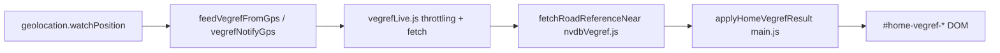

# Vegreferanse på forsiden – implementasjon og «koder»

Dette dokumentet beskriver hvordan vegreferansen på forsiden hentes og vises, og hvilke felt som brukes – egnet for feildiagnose. (Speiler prosjektplanen for vegreferanse; endringer i flyten gjøres i kildekoden referert under.)

## Arkitektur (dataflyt)

- **Inngang:** [`src/main.js`](../src/main.js) starter `startHomeVegrefTracking()` når forsiden vises. `navigator.geolocation.watchPosition` kaller `scheduleHomeVegrefLookup` → `feedVegrefFromGps` → `vegrefNotifyGps` i [`src/vegrefLive.js`](../src/vegrefLive.js).
- **Én felles kø** for forsiden og KMT (ta bilde): `initVegrefLive({ fetchRoadReferenceNear, applyHome, applyKmt, ... })` (søk etter `initVegrefLive` i `main.js`).
- **NVDB-kall:** `fetchRoadReferenceNear` i [`src/nvdbVegref.js`](../src/nvdbVegref.js) – nettleseren kaller Statens vegvesen direkte (ingen egen app-server for dette i flyten).

## NVDB API (nettverk)

- **URL:** `https://nvdbapiles.atlas.vegvesen.no/vegnett/veglenkesekvenser/segmentert`
- **Query:** `kartutsnitt` (bounding box rundt punktet), `srid=4326`, `antall=100`, `inkluderAntall=false`
- **Header:** `X-Client: Scanix`, `Accept: application/json`

**Feildiagnose:** CORS, 4xx/5xx fra NVDB, tomt `objekter`, eller nettverk/offline (da brukes cache/fallback i `vegrefLive.js`).

## Objektet som gis til UI (`describeSegmentForPoint` / `fetchRoadReferenceNear`)

Retur fra NVDB-laget er ett objekt med bl.a.:

| Felt | Betydning |
|------|-----------|
| `roadLine` | Offisiell tekstlinje, f.eks. «Riksveg 80» via `formatVegsystemLine` |
| `roadLineShort` | Kort: «RV 80» via `KATEGORI_SHORT` + nummer |
| `roadLineDisplay` | Forside-hovedtekst (`#home-vegref-primary`): for **kommunal veg (K)** med `adresse.navn` i NVDB brukes **gatenavn**; ellers som `roadLine` |
| `roadLineDisplayShort` | Kort variant til primær (EV/RV/FV/KV + nr eller gatenavn) |
| `s` | **Strekning** (`vegsystemreferanse.strekning.strekning` som streng), eller `–` |
| `d` | **Delstrekning** (`vegsystemreferanse.strekning.delstrekning`), eller `–` |
| `m` | **Meter** langs strekningen: interpolert fra `fra_meter`/`til_meter` og posisjon på geometri, eller `–` |
| `kortform` | NVDB `vegsystemreferanse.kortform` (tom streng hvis mangler) |
| `distToRoadM` | Avstand punkt → nærmeste punkt på polylinje (meter) |
| `nvdbId` | Stabil segment-ID (for «sticky» valg ved ustabil GPS) |

Kilde: `describeSegmentForPoint` i [`src/nvdbVegref.js`](../src/nvdbVegref.js).

## Vegkategori-bokstaver (kompakt «kode»)

I `nvdbVegref.js` mappes `vegkategori` til tekst og kort forkortelse:

- **E** → Europaveg / **EV**
- **R** → Riksveg / **RV**
- **F** → Fylkesveg / **FV**
- **K** → Kommunal veg / **KV** (kan byttes ut med **adressenavn** i `roadLineDisplay` når `cat === 'K'` og `seg.adresse.navn` finnes)
- **P** → Privat veg / **PV**
- **S** → Skogsbilveg / **SV**

## DOM på forsiden (hva som vises hvor)

HTML bygges i `main.js` (søk etter `home-vegref`):

- **`#home-vegref-primary`**: hovedlinje – typisk `roadLineDisplayShort` eller tilsvarende (`applyHomeVegrefResult`).
- **`#home-vegref-type`**: ekstra linje når **gatenavn** (`longDisplay`) skiller seg fra **offisiell** vegtype-linje (`longOfficial`); da vises f.eks. «KV …» der.
- **`#home-vegref-compact`** (tre linjer):
  - **`#home-vegref-s`**: prefikset `S` + `res.s` (strekning)
  - **`#home-vegref-d`**: prefikset `D` + `res.d` (delstrekning)
  - **`#home-vegref-meter`**: meter med suffiks `M` (`formatHomeVegrefMeterText`), med animasjon ved små endringer

Se `applyHomeVegrefResult` og `setHomeVegrefCompactDom` i [`src/main.js`](../src/main.js).

**Merk:** `S` og `D` i UI er **strekning** og **delstrekning** fra NVDB, ikke vegkategori-bokstaven «S» for skogsbilveg.

## Logikk som påvirker oppførsel

1. **Throttling** (`vegrefLive.js`): minimum intervall (~450 ms + avhengig av nøyaktighet), minimum bevegelse før ny fetch – kan gi forsinket oppdatering.
2. **Offline / feil:** gjenbruk av siste cache innen ~90 m, ellers koordinat-fallback (`Posisjon …°N …°Ø`, `s`/`d`/`m` som `–`).
3. **Ingen NVDB-treff (`null`):** forsiden **tømmes ikke** bevisst – siste gode visning beholdes.
4. **Stor avstand til veg:** hvis `distToRoadM > 95` m og det allerede finnes et resultat, ignoreres nytt treff (`HOME_VEGREF_MAX_DIST_SKIP_M` i `main.js`) – mot «hopp» ved dårlig GPS.
5. **Segmentvalg:** `pickBestSegment` i `nvdbVegref.js` scorer avstand + vegtype-straff (gang/sykkel +45 m); **hysterese** mot forrige `prevNvdbId` for å unngå hopp mellom parallelle veier.

## Styling

CSS under `.home-vegref` i [`src/style.css`](../src/style.css) (søk etter `home-vegref`).

## Oppsummering for diagnose

- Verifiser **HTTPS** og **geolocation** (ellers placeholder om sikker kontekst).
- I **Network**: NVDB-kallet til `nvdbapiles.atlas.vegvesen.no`, respons JSON og `objekter.length`.
- I **logikk**: **`s` / `d` / `m`** kommer fra NVDB `vegsystemreferanse` + geometri; **`roadLine*`** fra `vegkategori` + nummer eller adressenavn for K-veger.
